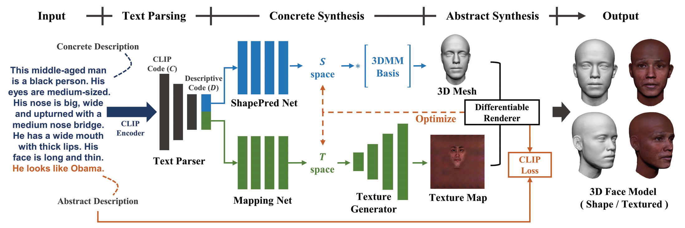
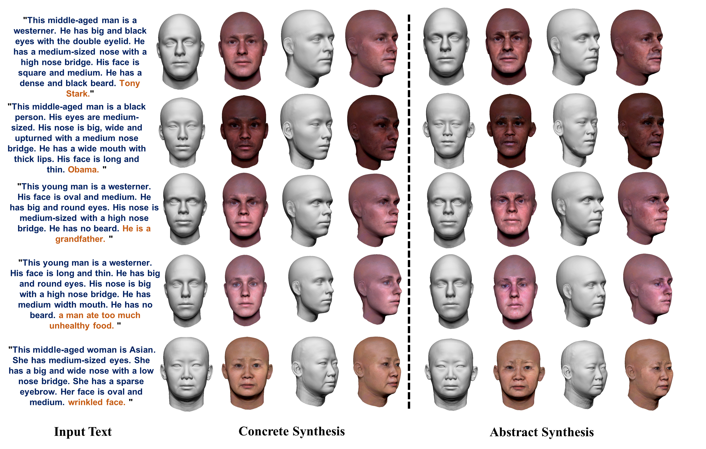

# 
# High-fidelity 3D Face Generation from Natural Language Descriptions (CVPR 2023)
This is the official repository of ''High-fidelity 3D Face Generation from Natural Language Descriptions'', CVPR 2023. [\[Project Page\]](https://mhwu2017.github.io/) [\[arXiv\]](https://arxiv.org/pdf/2305.03302.pdf)

## Our pipeline


## Visual Results


**\[Updates\]**

* 2023.05.04: Release the inference code and pre-trained model.

**\[To do list\]**

* Release Describe3D Dataset

## Getting started
#### Requirements
* Python = 3.8
* pytorch = 1.7.1
* cudatoolkit = 11.0

#### Configure the environment
1. First, you need to build the virtual environment.

```python
conda create -n describe3d python=3.8
```
2. Then, you need to install CLIP. Please refer to [https://github.com/openai/CLIP](https://github.com/openai/CLIP)
3. Install other dependencies.

```python
pip install -r requirements.txt
```
#### Usage
1. Download the pre-trained texture generation model and put it into the checkpoints/texture\_synthesis/

[https://drive.google.com/drive/folders/1zqCLaF-KzhWy\_YSMqKf15aEKiv19lXz5?usp=sharing](https://drive.google.com/drive/folders/1zqCLaF-KzhWy_YSMqKf15aEKiv19lXz5?usp=sharing)

2. Then you can run the main.py to generate 3D Faces.

```python
python main.py --name="your model name" --descriptions="the description of the face you want to generate." --prompt="the abstract descriptions"
```
Here is an example.

```python
python main.py --name="Stark" --descriptions="This middle-aged man is a westerner. He has big and black eyes with the double eyelid. He has a medium-sized nose with a high nose bridge. His face is square and medium. He has a dense and black beard." --prompt="Tony Stark."
```
The abstract synthesis results are affected by the regularization coefficient. Decrease lambda\_param / lambda\_latent when you want more changes of shape / texture. On the contrary, you can increase them.

